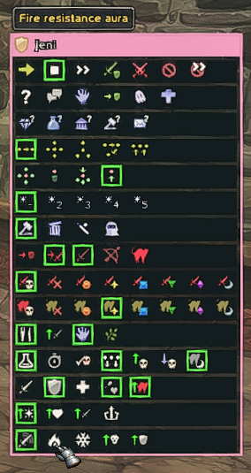

# Mangosbot UI (аддон клиента WoW)

## Установка
Скопируйте все файлы в папку Interface/Addons/Mangosbot (папку Mangosbot нужно создать заранее).

## Список ботов
Команда `/bot` открывает в игре окно Bot Roster. Нажмите `Login` в нужном окне, чтобы вызвать бота.

## Управление ботом
Выберите бота, чтобы открыть окно Bot Controls. Используйте кнопки для управления его действиями.

Аддон поддерживает локализации для трёх языков: английского, русского и китайского. 
